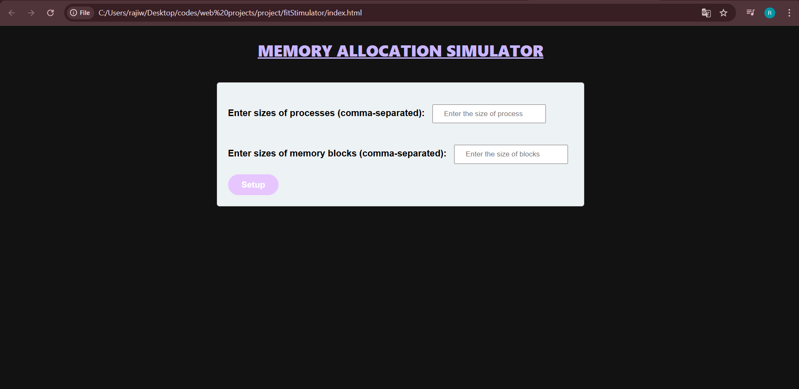

# Memory Allocation Simulator

This is a simulation tool for memory allocation techniques such as First-Fit, Best-Fit, and Worst-Fit.

## Features
- Simulates different memory allocation strategies.
- Visual representation of memory allocation.
- Supports dynamic memory management.

## Installation
1. Clone the repository:
   ```bash
   git clone https://github.com/Rrachana14/Memory-Allocation-Simulator.git
2. Navigate to the project directory:
    cd Memory-Allocation-Simulator
3. Run index file

  
